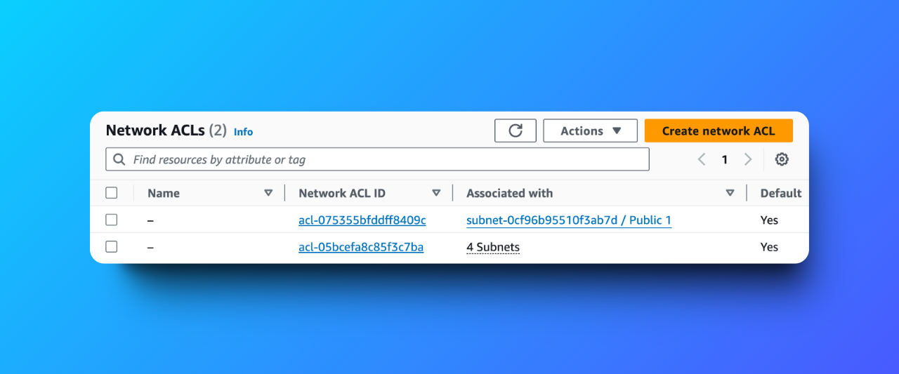

# VPC Traffic Flow and Security Project 🔒

 
 

---

## Overview
This project demonstrates the use of **Amazon Virtual Private Cloud (VPC)** to manage traffic flow and enhance security within an AWS environment. The primary focus is on configuring and integrating key networking components such as **Route Tables**, **Network Access Control Lists (NACLs)**, and **Security Groups** to achieve a secure and efficient network infrastructure.

---

## Table of Contents
1. [What is Amazon VPC?](#what-is-amazon-vpc)
2. [Project Objectives](#project-objectives)
3. [Key Components and Configurations](#key-components-and-configurations)
4. [Project Timeline](#project-timeline)
5. [Key Learnings](#key-learnings)
6. [Best Practices](#best-practices)
7. [Community and Acknowledgment](#community-and-acknowledgment)
8. [Author](#author)

---

## What is Amazon VPC?
Amazon Virtual Private Cloud (VPC) enables you to launch AWS resources in a logically isolated network that you define. It provides:
- **Enhanced Security**: Isolated networking environments.
- **Customization**: Complete control over network configurations.
- **Scalability**: Integration with other AWS services for seamless scaling.

---

## Project Objectives
1. Configure **Route Tables** to direct traffic efficiently.
2. Use **Security Groups** to define firewall rules for EC2 instances.
3. Apply **NACLs** for subnet-level traffic control.
4. Validate traffic flow and security configurations through testing.

---

## Key Components and Configurations

### 1. **Route Tables**
Route Tables determine where network traffic is directed within the VPC.
- **Key Setup**:
  - Public subnets require a route table entry with:
    - **Destination**: `0.0.0.0/0`
    - **Target**: Internet Gateway (IGW)
- **Example**: Configured a route to direct internet-bound traffic through the IGW.

### 2. **Security Groups**
Security Groups act as virtual firewalls for Amazon EC2 instances to control inbound and outbound traffic.
- **Rules**:
  - **Inbound**: Allow specific ports and IP ranges.
  - **Outbound**: Allow all traffic by default, with optional restrictions.
- **Configuration**: Defined custom rules to secure traffic to specific instances.

  

### 3. **Network Access Control Lists (NACLs)**
NACLs provide stateless, subnet-level traffic control.
- **Default Behavior**:
  - Allow all inbound and outbound traffic unless specified otherwise.
- **Custom Rules**:
  - Block traffic from specific IP ranges.
  - Permit only approved traffic flows.

---

## Project Timeline
- **Duration**: 50 minutes
  - VPC creation and configuration: 20 minutes
  - Documentation: 30 minutes

---

## Key Learnings
1. **Route Table Configurations**: Making subnets public by routing traffic to an Internet Gateway.
2. **Security Layering**: Combining NACLs and Security Groups for robust traffic control.
3. **Protocols and Ports**: Understanding how rules impact resource communication.
4. **Complexity Management**: Proper NACL configuration to prevent unintended restrictions.

---

## Best Practices
- Use both **NACLs** and **Security Groups** for layered security.
- Document configurations to ensure clarity and repeatability.
- Test traffic flows to confirm proper rule implementation.

---

## Community and Acknowledgment
Special thanks to [NextWork Community](https://link.nextwork.org/app?utm_source=app&utm_medium=nav&utm_campaign=referral) and **Natasha Ong** ([LinkedIn](https://www.linkedin.com/in/natasha-ong)) for their valuable guidance and insights.

---

## Author
**Hassan Gachoka**  
[LinkedIn](https://linkedin.com/in/gachokahassan)  
